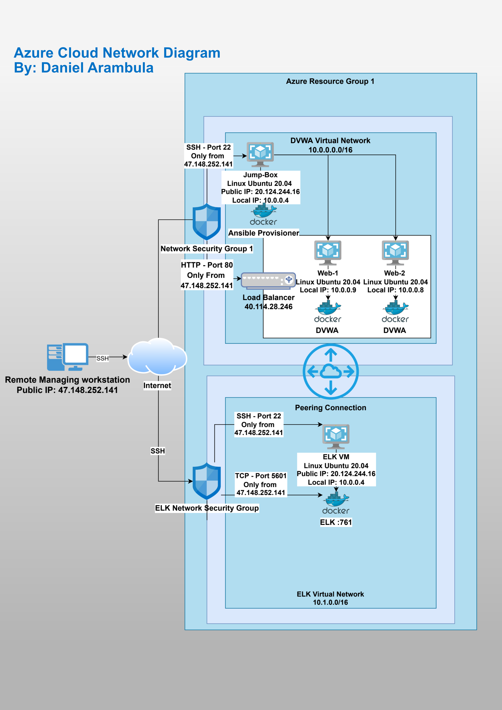

## Automated ELK Stack Deployment

The files in this repository were used to configure the network depicted below.

These files have been tested and used to generate a live ELK deployment on Azure. They can be used to either recreate the entire deployment pictured above. Alternatively, select portions of the _____ file may be used to install only certain pieces of it, such as Filebeat.

 

This document contains the following details:
- Description of the Topologu
- Access Policies
- ELK Configuration
  - Beats in Use
  - Machines Being Monitored
- How to Use the Ansible Build

### Description of the Topology

The main purpose of this network is to expose a load-balanced and monitored instance of DVWA, the D*mn Vulnerable Web Application.

Load balancing ensures that the application will be highly available, in addition to restricting access to the network. By using a Jump-box, we limit the configuration access to our virtual machiens and deployement of their Docker containers

Integrating an ELK server allows users to easily monitor the vulnerable VMs for changes to the logfiles and system resources.

The configuration details of each machine may be found below.

| Name     | Function | IP Address | Operating System |
|----------|----------|------------|------------------|
| Jump Box | Gateway  | 10.0.0.4   | Linux            |
| Web-1    | DVWA     | 10.0.0.9   | Linux            |
| Web-2    | DVWA     | 10.0.0.8   | Linux            |
| Elk      | Elk      | 10.1.0.4   | Linix            |

### Access Policies

The machines on the internal network are not exposed to the public Internet. 

Only the Jump Box machine can accept connections from the Internet. Access to this machine is only allowed from the following IP addresses: 47.148.252.141

Machines within the network can only be accessed by Jump Box, from IP 10.0.0.4

A summary of the access policies in place can be found in the table below.

| Name         | Publicly Accessible | Allowed IP Addresses |
|--------------|---------------------|----------------------|
| Jump Box     | Yes                 | 47.148.252.141       |
| Web-1        | No                  | 10.0.0.4             |
| Web-2        | No                  | 10.0.0.4             |
| Load Balancer| Yes                 | 47.148.252.141       |
| Elk VM       | Yes                 | 47.148.252.141       |

### Elk Configuration

Ansible was used to automate configuration of the ELK machine. No configuration was performed manually, which is advantageous because automating container delpoyment expedites the work, by minimizing errors, dramatically improves configuration time, while freeing resources to be utilized in more imporant tasks.

The playbook implements the following tasks:

- it installs Docker and Python module
- It increases virtual memory
- It sets max Memory usage to 262144 bytes
- It downloads and lanches Docker Elk container 

The following screenshot displays the result of running `docker ps` after successfully configuring the ELK instance.

### Target Machines & Beats
This ELK server is configured to monitor the following machines:
Web-1 10.0.0.9
Web-2 10.0.0.8

We have installed the following Beats on these machines:
Installed filebeat 7.6.1
Installed Metricbeat 7.6.1

These Beats allow us to collect the following information from each machine:
Filebeat gathers systemlogs and sending the information to Kibana for easy interpretation. In this system logs, we can expect to find information such as authorization or Kernel logs that could be useful for troubleshooting. 

Metricbeat gathetrs metrics related to server resources such CPU, Memory, Network resources utilized over time in the monitored servers. This information also fed to the Kibana interface and can be of great help when investigating incidents by anallyzing sudden spikes certain types of resources.

### Using the Playbook
In order to use the playbook, you will need to have an Ansible control node already configured. Assuming you have such a control node provisioned: 

SSH into the control node and follow the steps below:
- Copy the install-elk.yml file to /etc/ansible/.
- Update the Host file to include the IPs followed by of the taget ELK Server machine.
- Run the playbook, and navigate to the http://ELK-Server's-publicip:5601 to check that the installation worked as expected.